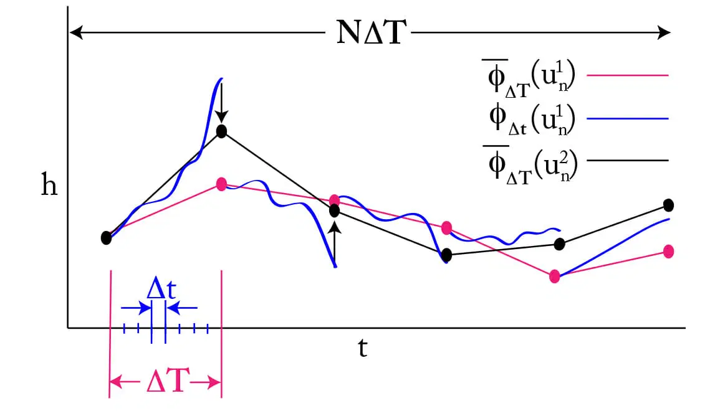

## Advanced Parallel in Time Algorithms (APinTA) for Partial Differential Equations

Time-parallel methods address the question of what to do when one has reached the limits of strong scaling (decreasing wall-clock time by increasing the number of processors working in parallel) through domain decomposition parallelisation in space. A milestone in the history of parallel-in-time algorithms is the Parareal algorithm (Maday and Turinici, 2002). In Parareal, successive time intervals are solved forwards in parallel. An iterative procedure is used to determine initial conditions for these time intervals, facilitated by a cheap but less accurate “coarse propagator” that is implemented sequentially. However, Parareal is not the only time-parallel algorithm, and there has been an explosion of parallel-in-time algorithms appearing in the literature in the last five years. A key lesson from the recent literature is that the success of parallel-in-time algorithms critically depends on them being carefully adapted to the PDE being solved. Much like regular time-stepping methods for PDEs, there are many parallel-in-time algorithms, and the right algorithm needs to be designed and selected according to the mathematical properties and applications requirements of the PDE. This calls for a design cycle from mathematics to computational science to applications science and back again; this is what our unique team provides.  

This is an [ExCALIBUR](https://excalibur.ac.uk/) funded project (PI: [Jemma Shipton](https://github.com/jshipton))
